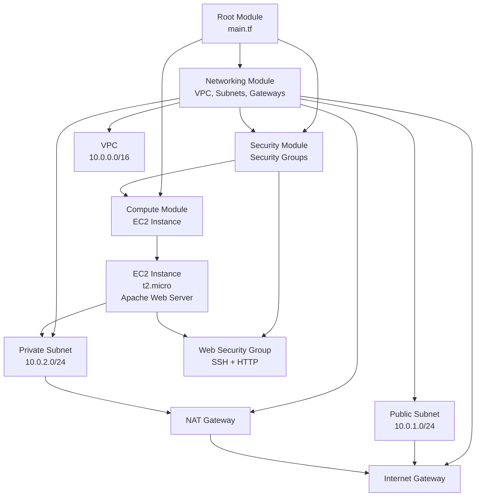

# Terraform AWS Demo

A production-ready Terraform project that provisions AWS VPC (Virtual Private Cloud) infrastructure (devices, servers, etc.) following architectural best practices. This project demonstrates module-based architecture, separation of concerns, proper variable validation, and clear dependency boundaries.

## Overview

This project creates a complete AWS networking infrastructure including:
- **VPC** with public and private subnets
- **Internet Gateway** for public internet access
- **NAT Gateway** for private subnet outbound access (Network Address Translation - private ip to public ip)
- **Security Groups** with configurable access rules
- **EC2 Instance** with automatic web server setup (Apache Web Server) - EC2 (Elastic Compute Cloud) is a web server instance in the private subnet.

## Architecture

The project follows a modular architecture with clear separation of concerns:



### Module Dependencies

The dependency flow is one-way and follows this pattern:

1. **Networking Module** (foundation) - No dependencies
2. **Security Module** - Depends on Networking (needs VPC ID)
3. **Compute Module** - Depends on Networking (needs subnet ID) and Security (needs security group IDs)

This ensures:
- Clear boundaries between modules
- No circular dependencies
- Easy testing and maintenance
- Predictable resource creation order

## Project Structure

```
terraform-aws-demo/
├── README.md                    # This file
├── main.tf                      # Root module - orchestrates child modules
├── variables.tf                  # Root-level variables with validation
├── outputs.tf                   # Root-level outputs
├── terraform.tfvars.example     # Example variable values
├── .gitignore                   # Terraform-specific ignores
├── modules/
│   ├── networking/              # Core networking logic
│   │   ├── README.md            # Module documentation
│   │   ├── main.tf
│   │   ├── variables.tf
│   │   ├── outputs.tf
│   │   └── versions.tf
│   ├── compute/                 # EC2 instance provisioning
│   │   ├── README.md
│   │   ├── main.tf
│   │   ├── variables.tf
│   │   ├── outputs.tf
│   │   └── versions.tf
│   └── security/                # Security groups and access policies
│       ├── README.md
│       ├── main.tf
│       ├── variables.tf
│       ├── outputs.tf
│       └── versions.tf
└── examples/                    # Example configurations
    └── minimal/
        ├── main.tf
        └── terraform.tfvars
```

## Features

### Best Practices Implemented

1. **Module-Based Architecture**
   - Clear separation of networking, compute, and security concerns
   - Reusable modules with well-defined interfaces
   - One-way dependency flow

2. **Variable Validation**
   - AWS region validation
   - CIDR block validation
   - Instance type validation
   - IP address validation for security rules

3. **Error Handling**
   - Input validation with helpful error messages
   - Resource preconditions and postconditions
   - Clear error context

4. **Standardized Configuration**
   - Consistent tagging strategy across all resources
   - Standardized naming convention
   - Environment-aware configuration

5. **Documentation**
   - Comprehensive README files
   - Module-level documentation
   - Inline comments for complex configurations
   - Usage examples

## Prerequisites

- **Terraform** >= 1.6.0 ([Download](https://www.terraform.io/downloads))
- **AWS Account** with appropriate permissions
- **AWS CLI** configured with credentials ([Install](https://aws.amazon.com/cli/))
- **AWS IAM User** with permissions to create:
  - VPC, Subnets, Route Tables
  - Internet Gateway, NAT Gateway, Elastic IPs
  - Security Groups
  - EC2 Instances

## Quick Start

### 1. Clone and Initialize

```bash
cd terraform-aws-demo
terraform init
```

### 2. Configure Variables

Copy the example variables file and customize:

```bash
cp terraform.tfvars.example terraform.tfvars
```

Edit `terraform.tfvars` and update:
- `aws_region` - Your preferred AWS region
- `allowed_ssh_cidr` - Your public IP (use `/32` for single IP)
  - Find your IP at: https://whatismyip.com

### 3. Plan and Apply

```bash
# Preview changes
terraform plan

# Apply changes (takes 5-10 minutes)
terraform apply
```

### 4. Verify

After apply completes, check the outputs:

```bash
terraform output
```

Access the EC2 instance (if in private subnet, you'll need a bastion or VPN).

### 5. Cleanup

To avoid ongoing charges:

```bash
terraform destroy
```

## Configuration

### Key Variables

| Variable | Description | Default |
|----------|-------------|---------|
| `aws_region` | AWS region | `us-east-1` |
| `vpc_cidr` | VPC CIDR block | `10.0.0.0/16` |
| `public_subnet_cidr` | Public subnet CIDR | `10.0.1.0/24` |
| `private_subnet_cidr` | Private subnet CIDR | `10.0.2.0/24` |
| `instance_type` | EC2 instance type | `t2.micro` |
| `allowed_ssh_cidr` | SSH access CIDR | `0.0.0.0/0` |
| `enable_nat_gateway` | Enable NAT Gateway | `true` |

See `variables.tf` for complete variable documentation.

### Security Considerations

⚠️ **Important Security Notes:**

1. **SSH Access**: Restrict `allowed_ssh_cidr` to your IP address in production
   - Use `/32` CIDR notation: `"203.0.113.42/32"`
   - Never use `0.0.0.0/0` for SSH in production

2. **HTTP Access**: Consider restricting `allowed_http_cidr` based on your needs

3. **NAT Gateway Costs**: NAT Gateway costs ~$0.045/hour (~$32/month)
   - Set `enable_nat_gateway = false` for development to reduce costs
   - Note: Private subnet will have no internet access without NAT Gateway

## Module Documentation

Each module has its own README with detailed documentation:

- [Networking Module](modules/networking/README.md) - VPC, subnets, gateways, routing
- [Security Module](modules/security/README.md) - Security groups and access policies
- [Compute Module](modules/compute/README.md) - EC2 instance provisioning

## Cost Estimation

### AWS Free Tier (First 12 Months)

- **t2.micro EC2**: 750 hours/month - **FREE**
- **NAT Gateway**: Not Free Tier eligible - **~$32/month**
- **Data Transfer**: 1 GB/month - **FREE**

### After Free Tier

- **t2.micro EC2**: ~$0.0116/hour (~$8.50/month)
- **NAT Gateway**: ~$0.045/hour (~$32/month)
- **Elastic IP**: Free when attached to running instance
- **Data Transfer**: Varies by region

**Estimated Monthly Cost (with NAT Gateway)**: ~$40-50/month

**To Reduce Costs:**
- Set `enable_nat_gateway = false` (saves ~$32/month)
- Use `t2.micro` instance type
- Destroy resources when not in use: `terraform destroy`

## Examples

See the [examples/](examples/) directory for additional configuration examples.

### Minimal Example

```hcl
module "networking" {
  source = "../../modules/networking"
  # ... minimal configuration
}
```

## Troubleshooting

### Common Issues

1. **"Error: InvalidRegion"**
   - Ensure `aws_region` is a valid AWS region identifier
   - Check your AWS CLI configuration: `aws configure list`

2. **"Error: InsufficientPermissions"**
   - Verify your AWS credentials have required permissions
   - Check IAM user policies

3. **"Error: NAT Gateway creation timeout"**
   - NAT Gateway creation can take 5-10 minutes
   - Check AWS Console for status

4. **"Error: InvalidCIDRBlock"**
   - Ensure CIDR blocks don't overlap
   - Verify subnet CIDRs are within VPC CIDR

## Extending the Project

### Adding More Subnets

Edit `modules/networking/main.tf` to add additional subnets following the existing pattern.

### Adding More Security Groups

Edit `modules/security/main.tf` to add additional security groups.

### Adding More EC2 Instances

Add additional instances in `modules/compute/main.tf` or create multiple compute module calls in root `main.tf`.

### Adding CloudWatch Alarms

Create a new `modules/monitoring/` module for CloudWatch alarms and metrics.

## Best Practices Demonstrated

This project demonstrates:

1. ✅ **Separation of Entrypoint from Core Logic**
   - Root module (`main.tf`) only orchestrates
   - Business logic in dedicated modules

2. ✅ **Package Organization by Responsibility**
   - `modules/networking/` - Core domain logic
   - `modules/security/` - Access policies
   - `modules/compute/` - Resource provisioning

3. ✅ **Interface Contracts at Boundaries**
   - Well-defined module inputs/outputs
   - Clear data contracts between modules

4. ✅ **Error Handling**
   - Variable validation with context
   - Resource preconditions/postconditions
   - Clear error messages

5. ✅ **Standardized Configuration**
   - Consistent tagging strategy
   - Standardized naming conventions
   - Environment-aware configuration

6. ✅ **Documentation**
   - Architecture diagrams
   - Module-level documentation
   - Usage examples

## Contributing

This is a demonstration project. Feel free to:
- Add additional modules
- Improve documentation
- Add more examples
- Enhance error handling

## License

This project is provided as-is for educational and demonstration purposes.

## References

- [Terraform AWS Provider Documentation](https://registry.terraform.io/providers/hashicorp/aws/latest/docs)
- [AWS VPC Documentation](https://docs.aws.amazon.com/vpc/)
- [Terraform Best Practices](https://www.terraform.io/docs/cloud/guides/recommended-practices/index.html)
